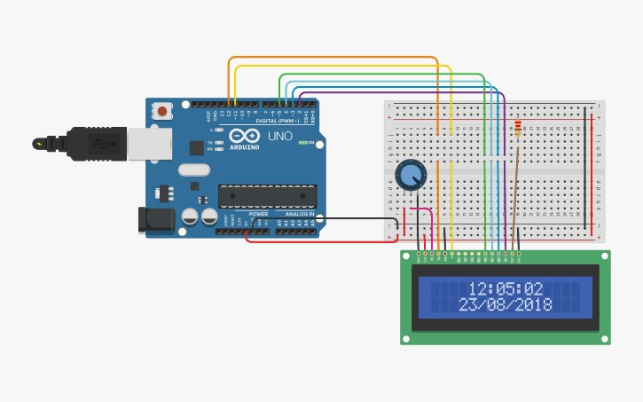
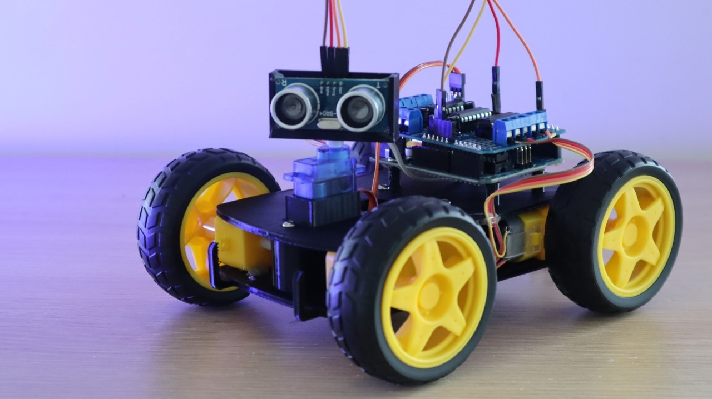
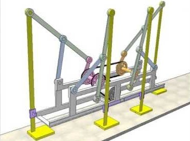
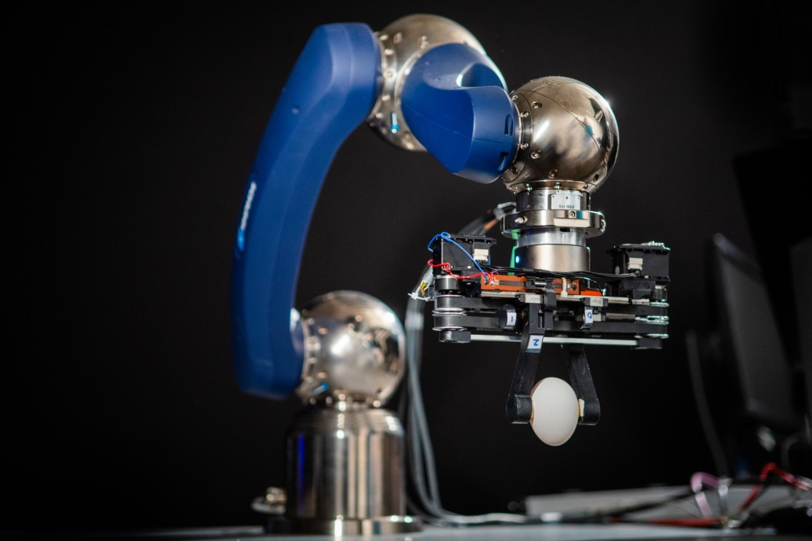
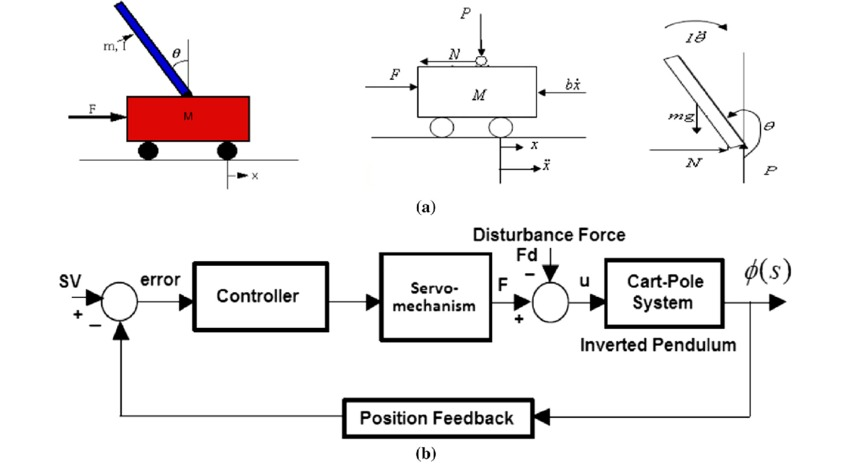
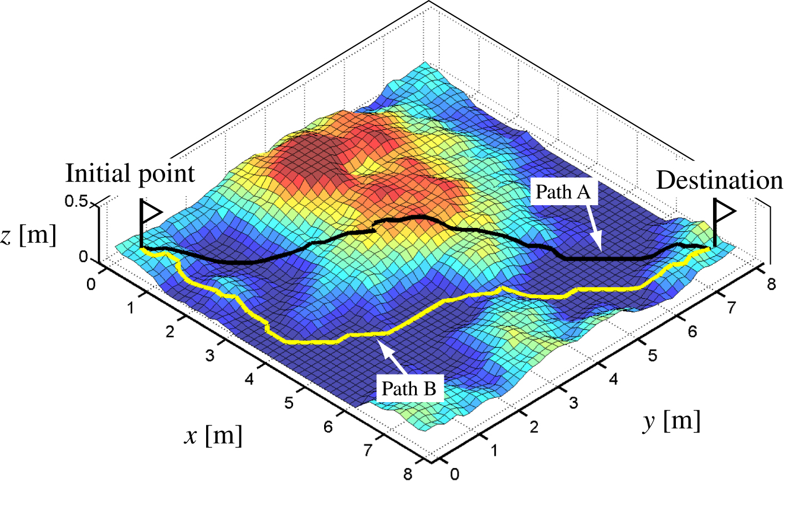
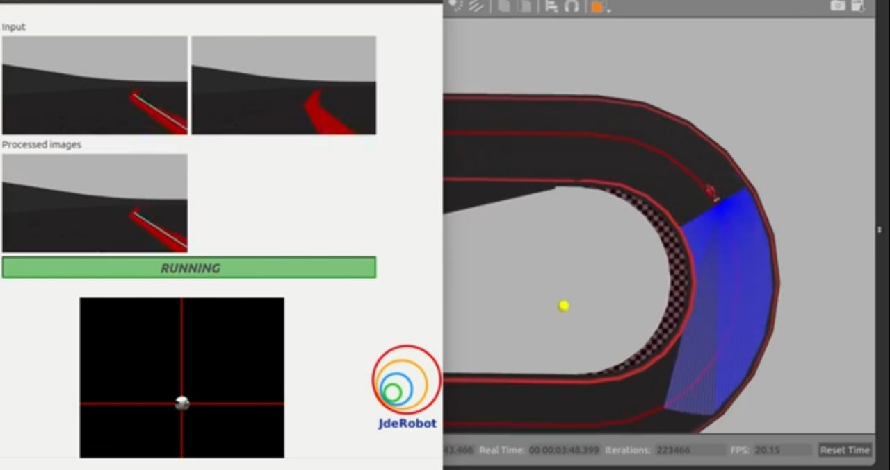

<head>
<link rel="stylesheet" href="https://maxcdn.bootstrapcdn.com/font-awesome/4.7.0/css/font-awesome.min.css">
<link rel="stylesheet" href="https://cdnjs.cloudflare.com/ajax/libs/font-awesome/4.7.0/css/font-awesome.min.css">
<meta name="viewport" content="width=device-width, initial-scale=1">

</head>

<section id="one">
    

	

		
The best way to learn is to get your hands dirty. Keeping this in mind, we have prepared a set of mini-projects for you to dive into the field of robotics. Together, the projects cover a wide variety of fields so that there is something to try, no matter what your area of interest.

	    
The projects are designed to be completed in 5-6 weeks in small teams. Each project has been allotted ERC members as mentors. Every week, you will be given resources to learn about and practice a concept required to complete the project. The mentors will be there to solve your doubts and help you troubleshoot. They will also hold weekly meetings to take project updates and help out with any problems.

        
This will be a great opportunity not only to develop new skills but also to get to know ERC members. We will be looking out for those of you who show enthusiasm throughout the projects to be inducted into the club. And while we’ll do our best to provide guidance, ultimately it will be up to you to learn and put in the effort to complete the project.

        
<b>Note:</b> To apply for more than one project, you may submit this form multiple times (though you can only take a maximum of two projects).

		<h4>Deadline for registeration is 25th Jan EOD</h4>
	

<section id="two" class="spotlights">

<ul class="actions">
<li><a href="https://docs.google.com/forms/d/e/1FAIpQLSfxGp9lZC7TelZEwytV6WU0c7O_Y86gZ79Sx3pPB35nfqRg7g/viewform?usp=sf_link" target="blank" class="button sign">Sign Up Here</a></li>
</ul>

<header class="major">
<h1>Electronics</h1>
</header>

    <section>
		
		

			

				<header class="major">
					<h3><a href="https://docs.google.com/document/d/1SyvJi2ebhtIxws-zDsgQIpjIAVBZHq9-m-yNXoJQCZM/edit?usp=sharing" target="blank"> Arduino Clock 

</a></h3>
				</header>
				
Arduino is an open-source prototyping platform in electronics based on easy-to-use hardware and software. It is a microcontroller-based prototyping board capable of developing digital devices that can read inputs like a finger on a button, touch on a screen, light on a sensor etc. This project aims to create a clock using an Arduino in TinkerCAD, including timer and stopwatch features. During its course, you will learn how to use Arduino’s hardware timers and interrupts, and peripherals like LCDs, buttons, and LEDs.
				

			

		

	</section>
    <section>
		
		

			

				<header class="major">
					<h3><a href="https://docs.google.com/document/d/12QYzrYppNINaOPEKVCVEJiHTvlqlHUtvJKc4AUpfJY4/edit?usp=sharing" target="blank">Arduino Obstacle Avoiding Car Controller 

</a></h3>
				</header>
				
Thanks to its versatility and simplicity, the Arduino is extensively used to control robots. One of the necessary skills of any robot is to move without bumping into objects. This project aims to create a fundamental obstacle avoiding car circuit, which is one of the simplest beginner’s robotics projects. Although you will not construct the entire bot, you will design and simulate the controller circuit based on an Arduino UNO. Learning objectives include differential drives, ultrasonic distance sensors and motor control.
                

			

		

	</section>

<header class="major">
<h1>Mechanical</h1>
</header>

	<section>
		
		

			

				<header class="major">
					<h3><a href="https://docs.google.com/document/d/1aItefm6bpi3_RwD4nP8uSgtvWNJuPpbdZpNd8SqzVJw/edit?usp=sharing" target="blank">Chebyshev Lambda Mechanism 

</a></h3>
				</header>
				
A mechanical linkage is an assembly of bodies connected to manage forces and movement. A kinematic chain, in which one link is fixed or stationary, is called a mechanism. Linkages are an integral part of robotics; the skeletons of robotic systems are examples of spatial linkages. This project aims to design and create a walking robot based on Chebyshev Lambda Mechanism. Also, learn how to use most of the tools and features of Solidworks or Fusion360 since we will do the robot’s mechanical design and assembly on Solidworks or Fusion360.
				

			

		

	</section>
    <section>
		
		

			

				<header class="major">
					<h3><a href="https://docs.google.com/document/d/1CTbPiiDTvGyH7ph43QfNXturaXg3IwnXfeLiGglcLFg/edit?usp=sharing" target="blank">Robot Gripper and Arm 

</a></h3>
				</header>
				
If you think of a simple industrial robot as consisting of an arm, with an 'elbow' and a 'wrist' for motion and a 'hand' for picking things up, you're not being childish –in fact, you're thinking like a roboticist. Industrial robot 'arms', as they are called, do have elbows and wrists. At the end of the arm, robots are often fitted with what are called grippers – special devices designed to help robots handle objects in the real world. This project aims to design and create a conceptual Robot arm along with its gripper. Also, learn how to use most of the tools and features of Solidworks or Fusion360 since we will do the robot's mechanical design and assembly on Solidworks or Fusion360.
                

			

		

	</section>

<header class="major">
<h1>Automation & Control</h1>
</header>

    <section>
		
		

			

				<header class="major">
					<h3><a href="https://docs.google.com/document/d/1QwIIwDc4N1uj8cpsDlXGhx9-6336v1r2SXOnRFeSPQY/edit?usp=sharing" target="blank">Control of an Inverted Pendulum on a Cart 

</a></h3>
				</header>
				
Humans can balance on two legs, walk and handle objects effortlessly, for robots, this challenge has sprouted a whole field called Control Theory. It aims to develop methods to provide just the right amount of control signals based on feedback the robot gets from its environment. In this project you will learn about basic control theory and apply it to solve the classic cartpole problem. Then you will learn how to make models in Simulink using Simscape Multibody and use it to test various controller algorithms implemented in MATLAB.
                

			

		

	</section>
    <section>
		
		

			

				<header class="major">
					<h3><a href="https://docs.google.com/document/d/11TGGZWwxyyulVB-nom0M1SRQ-eiR_sVVVyfmWgM_yMA/edit?usp=sharing" target="blank">Neural Networks and Reinforcement Learning 

</a></h3>
				</header>
				
Neural networks have revolutionized what we can do with Machine Learning. When combined with Reinforcement Learning, we get a powerful method which allows robots to learn a complex range of behaviors. In this project you’ll learn the maths behind Neural Networks and build one yourself from scratch. You’ll also learn the basics of Reinforcement Learning and build a program that can learn to solve a simple task purely from experience. In the end, we’ll combine the two to train an agent to play video games.
                

			

		

	</section>
    <section>
		
		

			

				<header class="major">
					<h3><a href="https://docs.google.com/document/d/1pb-Ae4ceqHWieKRDp98uPoif1GNRWpI5U31pZO0ghLg/edit?usp=sharing" target="blank">Path Planning with Python 

</a></h3>
				</header>
				
Path planning is something humans do effortlessly, but takes a little more effort for robots. It involves planning a path from a start to a goal in a given environment while avoiding obstacles. It is a fundamental aspect of navigation in any form, and is used extensively throughout robotics. In this project, you will learn about the maths behind different classes of algorithms used for path planning and implement them from scratch in python.
                

			

		

	</section>
    <section>
		
		

			

				<header class="major">
					<h3><a href="https://docs.google.com/document/d/1Qu_r6dNSYyElHaHv1HFzqbcwRCEXIRj92t5haiKI96c/edit?usp=sharing" target="blank">Computer Vision based Line Follower 

</a></h3>
				</header>
				
Line followers are one of the most widely used robots. They are used to navigate all sorts of places and work by following a line made on the ground. With the advent of Deep Learning, Computer Vision is gaining popularity in robotics for perception. In this project, you will be making a line following-robot which uses computer vision to detect the line and follow it using a feedback based mechanism. You will learn to use OpenCV for perception and also about simple control algorithms.
                

			

		

	</section>
</section>

