<!-- Main -->

<!-- One -->
<!--<section id="one">
	

		<header class="major">
			<h2>Major Projects:</h2>
		</header>
		

		Some of our major projects are mentioned below. 
		Do check out the archives also, you will definitely find out something of your interest (^_^ )  
		
		<!--<a href="archive.erc to be inserted">Click here or on the flopp disk to access archive
		</a>->
		

	

</section>-->

<!-- Two -->

<header class="major">
<h1>Ongoing</h1>
</header>

<section id="two" class="spotlights">

	<section>
		
		

			

				<header class="major">
					<h3>Trotbot</h3>
				</header>
				
Team Lead: Harshal Deshpande  
				Trotbot is a multipurpose robot, designed to serve autonomously in indoor environment. It can be used as follows:
				To deliver packages from one location to another in offices, construction sites etc.
				It can also be teleoperated to nearby locations using the camera feed.
				The robot will be able to autonomously navigate around obstacles and reach waypoints set in and around the environment with the use of onboard sensors and be able to detect it's location.
				Currently, we are looking at visual odometry as an alternative for mouse for localisation of the robot.
				

				<ul class="actions">
					<li><a href="https://github.com/ERC-BPGC/Trotbot" target="blank" class="button">GitHub Repo</a></li>
				</ul>
			

		

	</section>
	
	<section>
		<a class="image">
			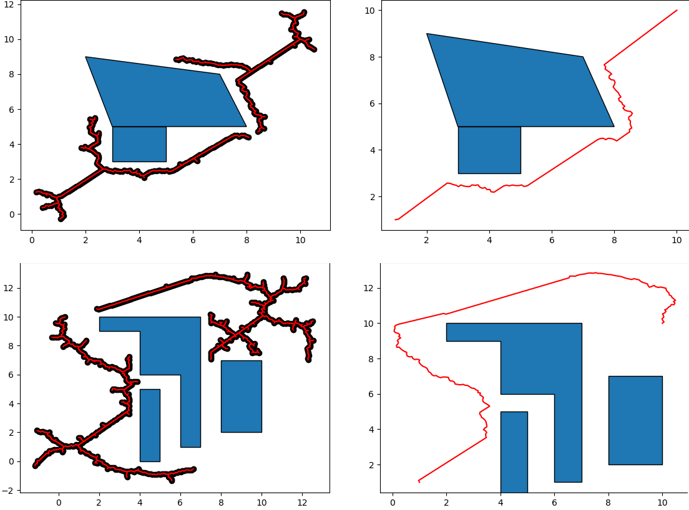
		</a>
		

			

				<header class="major">
					<h3>GenNav</h3>
				</header>
				
Team Lead: Atharv Sonwane  
				Gennav aims to create a general purpose python library that can be used for path planning in various robotics settings. It will have a collection of path planning algorithms, motion controllers along with various utilities to handle different methods of path optimisation, environment representation and eventually a geometry module to handle the underlying computations. Currently focused on the 2D path planning aspect of navigation.Rather than writing a big new python file for each new path planning algorithm, we could build on already defined utilities and primitives. This would be a big help to anyone working on any robot with autonomous navigation capabilities in the future. All they would need to do is implement the robot specific code and use gennav for the planning, control and optimization heavy lifting.
				

				<ul class="actions">
					<li><a href="https://github.com/ERC-BPGC/gennav" target="blank" class="button">GitHub Repo</a></li>
				</ul>
			

		

	</section>

	<section>
		<a class="image">
			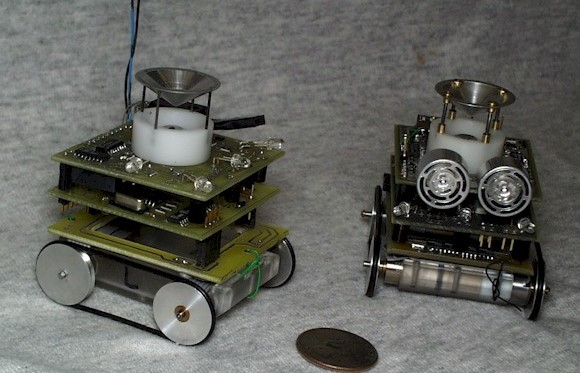
		</a>
		

			

				<header class="major">
					<h3>EchoSLAM</h3>
				</header>
				
Team Lead: Tanmay Bhonsale and Aadhar Sharma  
				EchoSLAM is based on the idea of using sound waves to localise a team of robots and help them navigate their environment. It is inspired by previous work like Millibots and MaxelBot, but seeks to extend their functionality by implementing Simultaneous Localization and Mapping (SLAM). The system proposed is potentially cheaper, more compact, and less computationally intensive than alternatives like RADAR, LiDAR etc, thus enabling the creation of large, coordinating, decentralised robots in an economical manner.
				

				<ul class="actions">
					<li><a href="https://github.com/ERC-BPGC/echoslam_ROS" target="blank" class="button">GitHub Repo</a></li>
				</ul>
			

		

	</section>

	<section>
		<a class="image">
			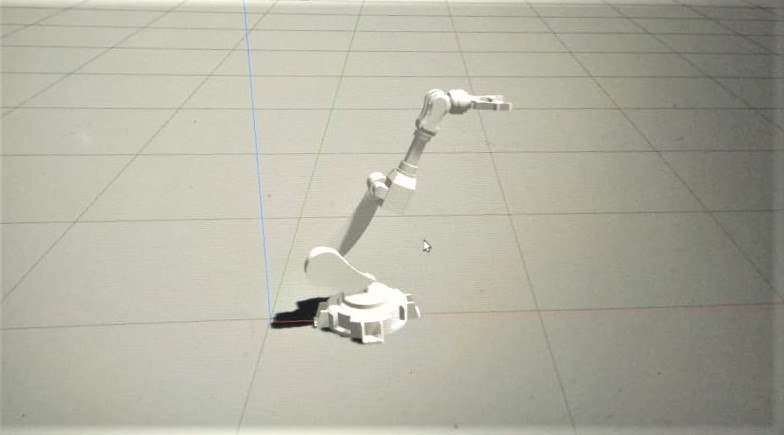
		</a>
		

			

				<header class="major">
					<h3>RoManOv</h3>
				</header>
				
Team Lead: Abhishek Dixit  
				We aim to build a robotic manipulator that can autonomously recognise, pick and place objects and ultimately perform complex tasks like playing a game of chess using Deep Learning and Computer Vision. RoManOV is also expected to analyse the surrounding circumstances and plan the assigned tasks suitably taking into account the various constraints.
				The arm has been constructed and modelled on Gazebo, a ROS-based simulator. Further, the kinematics and motion planning are currently under-work on MoveIt.
				

				<ul class="actions">
					<li><a href="https://github.com/abhidxt299/RoManOV_Automation/" target="blank" class="button">GitHub Repo</a></li>
				</ul>
			

		

	</section>

	<section>
		<a class="image">
			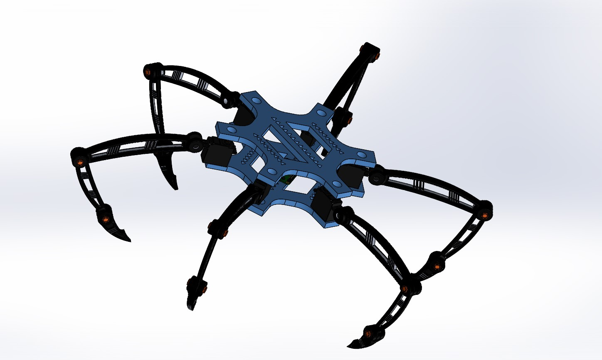
		</a>
		

			

				<header class="major">
					<h3>SpiderBot</h3>
				</header>
				
Team Lead: Ashutosh Gupta  
				Project SpiderBot started in Feb 2020, is a hexapod with six independent legs, each with three degrees of freedom. One advantage of legged robots is that it can climb over obstacles larger than itself. Hexapod walking robots also benefit from a lower impact on the terrain and have greater mobility in surroundings. 
				The purpose of this robot is to make a multi terrain robot that can traverse through the most difficult terrains and study various walking gaits and controllers to find the optimum one for this kind of system. 
				Currently we are working on a quadruped model and testing various controllers and walking gaits on it, before we move on to the hexapod to get a more thorough understanding of the proces.
				

				<ul class="actions">
					<li><a href="https://github.com/Ashutosh781/quadruped-simulink" target="blank" class="button">GitHub Repo</a></li>
				</ul>
			

		

	</section>

	<section>
		<a class="image">
			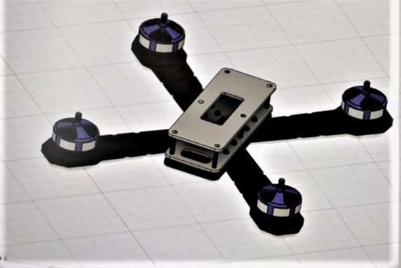
		</a>
		

			

				<header class="major">
					<h3>Carborone</h3>
				</header>
				
Team Lead: Vinay Sabarad  
				This project aims to Create a model of Autonomous drone car. Which can analyse the environment and take decisions using OpenCV and decide whether to move on the ground or fly to avoid an obstacle and decide its own trajectory . It’s main aim is to improve the applications of a car on the ground so that it could  travel to even the most difficult places than it would be possible for a normal car. We also aim to have a power efficient version of drone car that can fly for longer durations and make it more accessible by safely going to different locations.
				

				<ul class="actions">
					<li><a href="https://github.com/4825vinay/Project-Carborone" target="blank" class="button">GitHub Repo</a></li>
				</ul>
			

		

	</section>

	<section>
		<a class="image">
			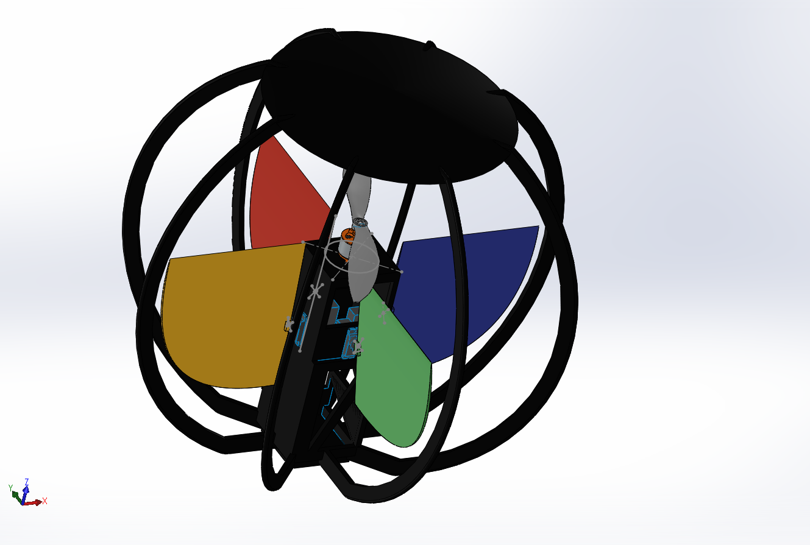
		</a>
		

			

				<header class="major">
					<h3>Ball-Drone</h3>
				</header>
				
Team Lead: Cheriyan Homey  
				Ball drone is a ‘uni-rotor’ VTOL drone that is maneuvered using four control surfaces. The drone is capable of performing all the tasks done by a conventional quadcopter using less power. The spherical shell also helps in protecting the inner hardware and rotating propeller from any immediate threat. . The spherical shell will be 3D printed and the flight controller will be made with an ESP32 microcontroller and a MPU 9250. A CAD model and a simulator of the drone on Simscape multibody is made.
				

			

		

	</section>

<header class="major">
<h1>Completed</h1>
</header>

	<section>
		<a class="image">
			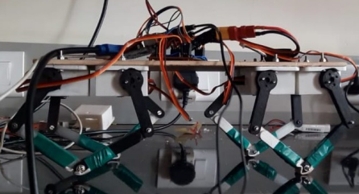
		</a>
		

			

				<header class="major">
					<h3>Quadruped <i>a.k.a. Bhaagwati</i></h3>
				</header>
				
Team Lead: Mohit Gupta 
				The main objective is to mimic a four legged animal and get various gaits out of it like trot, bound, canter through open loop and closed loop methods. It will be further used as a platform for attachment of vision based system for mapping different terrains
				We have successfully deployed trotting walk on the quadruped. A ROS(Robot Operating System) package is also created. A static self-stabilizing PID controller using an IMU has been created and successfully deployed on the quadruped.
				Different gaits will be tested on the quadruped. A dynamic stabilizing strategy will be developed. Later, environment tracking using realsense depth camera will be developed.
				

				<ul class="actions">
					<li><a href="https://github.com/MohitGupta007/Quadruped_BPGC" target="blank" class="button">Github Repo</a></li>
				</ul>
			

		

	</section>

	<section>
		<a class="image">
			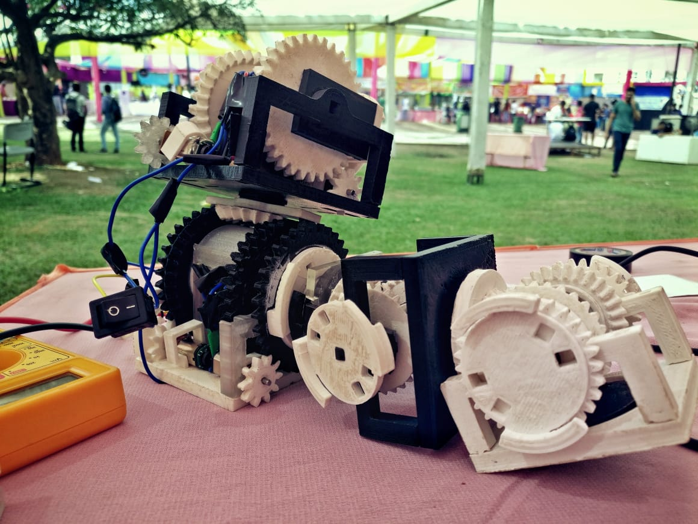
		</a>
		

			

				<header class="major">
					<h3>Modbot</h3>
				</header>
				
Team Lead: Prathmesh Thorwe  
				Modular Robots are a system of individual modules capable of linking to each other to form reconfigurable structures suited for different purposes. Using this method, a single system can be used for a wide range of applications. This is useful when the task/environment of a bot is not known beforehand.
				The project aimed to design, simulate and manufacture such modules with maximum DOFs possible for a highly flexible and robust system. A single module was manufactured capable of teleoperation. An Arduino Nano and an ESP32 were used to control the input to the respective motors.
				

				<ul class="actions">
					<li><a href="https://github.com/rmvanarse/modbot2" target="blank" class="button">GitHub Repo</a></li>
				</ul>
			

		

	</section>

	<section>
		<a class="image">
			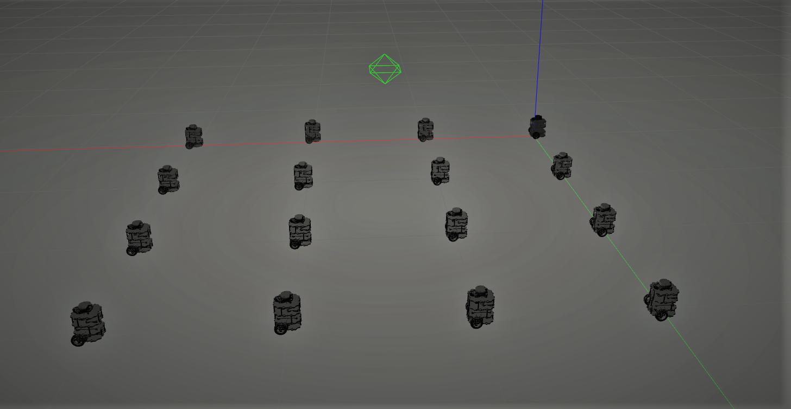
		</a>
		

			

				<header class="major">
					<h3>Swarmbots</h3>
				</header>
				
Team Lead: Rishikesh Vanarse  
				Swarm robotics is an approach to coordinate multiple robots as a system, which consists of large numbers of mostly simple physical robots.The project aimed at the task to automate a decentralized swarm of autonomous mobile robots to carry out different tasks. The bots do not communicate with each other, and perform tasks through 'collective decision making' algorithms.
				Multiple simulations have been created to perform tasks such as line formation, circle formation, etc. Along with this evaluation metrics were attached to each task to monitor the quality.
				

				<ul class="actions">
					<li><a href="https://github.com/rmvanarse/swarm_tasks" target="blank" class="button">GitHub Repo</a></li>
				</ul>
			

		

	</section>

	<section>
		<a class="image">
			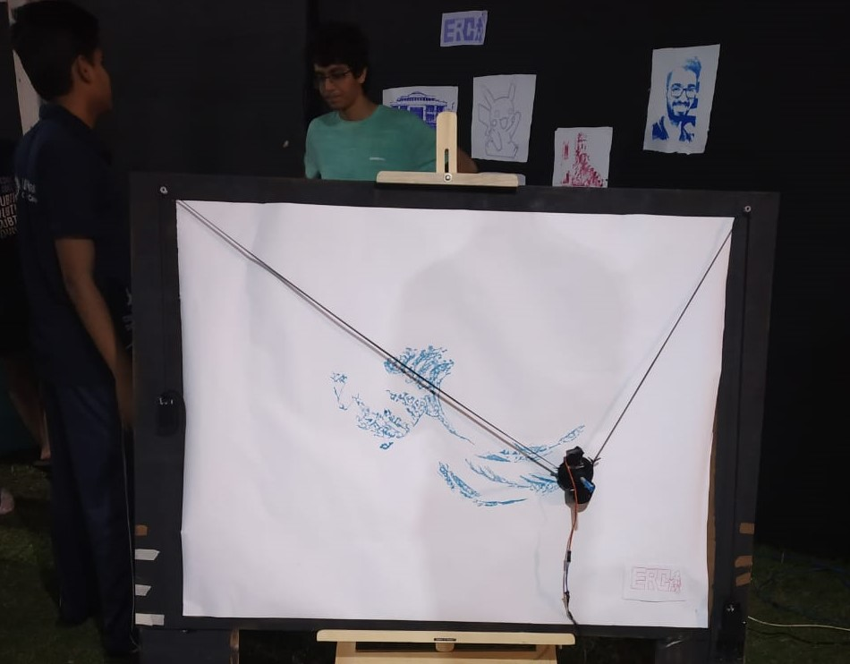
		</a>
		

			

				<header class="major">
					<h3>Sketcher</h3>
				</header>
				

				Sketcher was one of the display projects displayed in Quark 2020 by the ERC. It is basically a full-scale prototype of a polargraph-a fully automated drawing machine capable of rendering one image into multiple artistic forms on paper. It  supports multiple drawing styles such as stipples, travelling salesperson, D2S etc.
				

				<ul class="actions">
					<li><a href="https://github.com/ERC-BPGC/Sketcher" target="blank" class="button">GitHub Repo</a></li>
				</ul>
			

		

	</section>

	<section>
		<a class="image">
			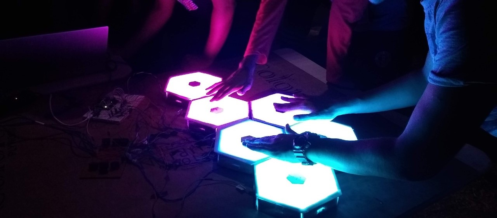
		</a>
		

			

				<header class="major">
					<h3>LED Hexapad</h3>
				</header>
				

				The LED Hexapad was an interactive display piece for Quark 2020. At its heart it is a MIDI controller with six touch sensitive pads, that can trigger a wide range of virtual instruments on a computer. In addition to this, each hexagonally shaped pad is illuminated by NeoPixel LEDs which show dynamic animations that react to human touch.
				

				<ul class="actions">
					<li><a href="https://github.com/ERC-BPGC/LED-Octapad" target="blank" class="button">GitHub Repo</a></li>
				</ul>
			

		

	</section>

	<section>
		<a class="image">
			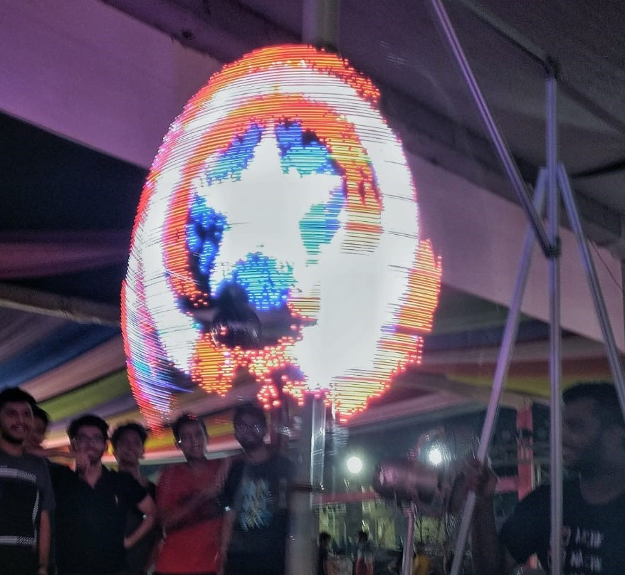
		</a>
		

			

				<header class="major">
					<h3>LED Globe</h3>
				</header>
				
Team Lead: Mohit Gupta  
				LED Globe was the flagship display project from ERC for Quark 2019, the technical fest of BITS-Goa.
				The globe consisted of two 75 cm radius acrylic semicircular discs having LEDs along the perimeter of one of them. This setup was mounted vertically on an aluminium frame. The setup would be rotated using a high torque motor. The synchronised firing of LEDs created the illusion of an image.
				The programming that was involved allowed one to take any image from the internet, divide it into a number of segments which the code could recognize and thus program the LEDs in that manner.
				

			

		

	</section>

	<section>
		<a class="image">
			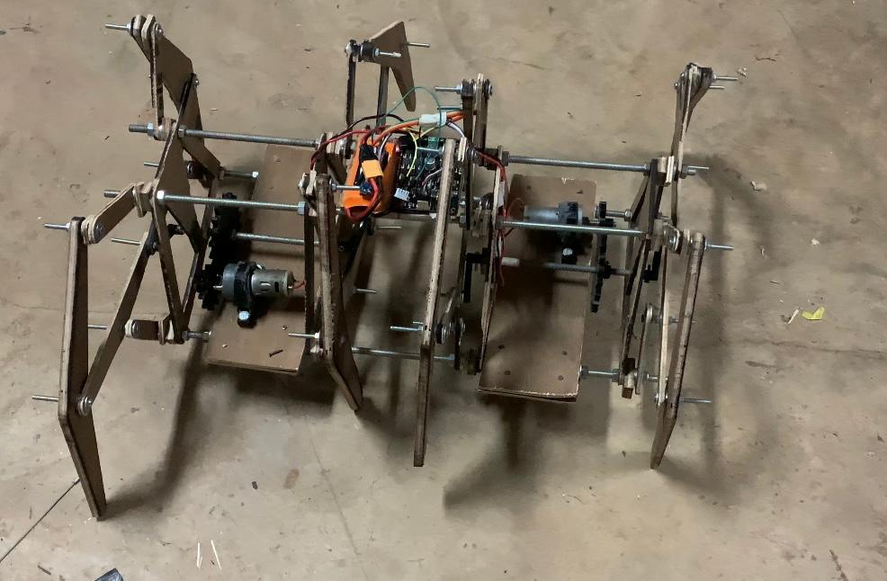
		</a>
		

			

				<header class="major">
					<h3>Klann</h3>
				</header>
				
Klann was one of the display projects displayed in Quark 2020 by the ERC. The eight-legged walking bot was based on the Klann linkage, a planar mechanism designed to simulate the gait of a legged animal and function as a wheel replacement.
				

			

		

	</section>
</section>

